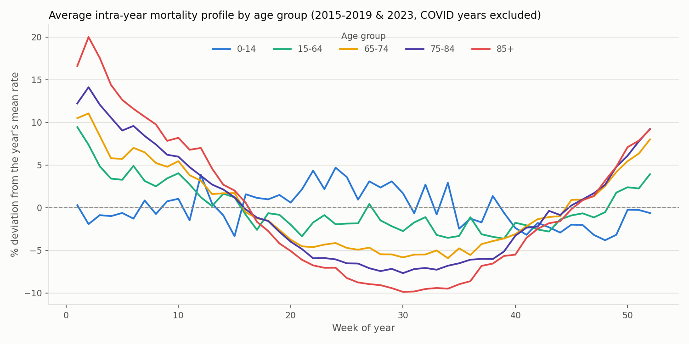
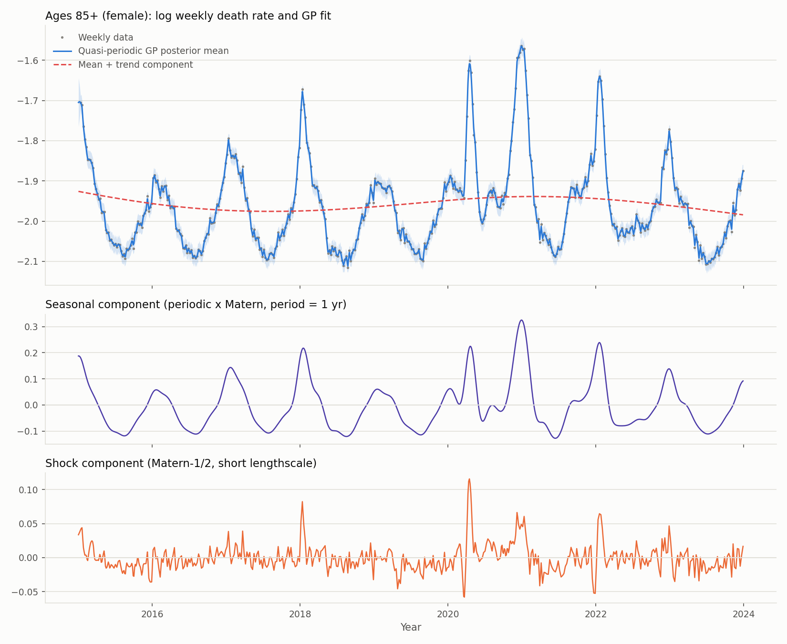
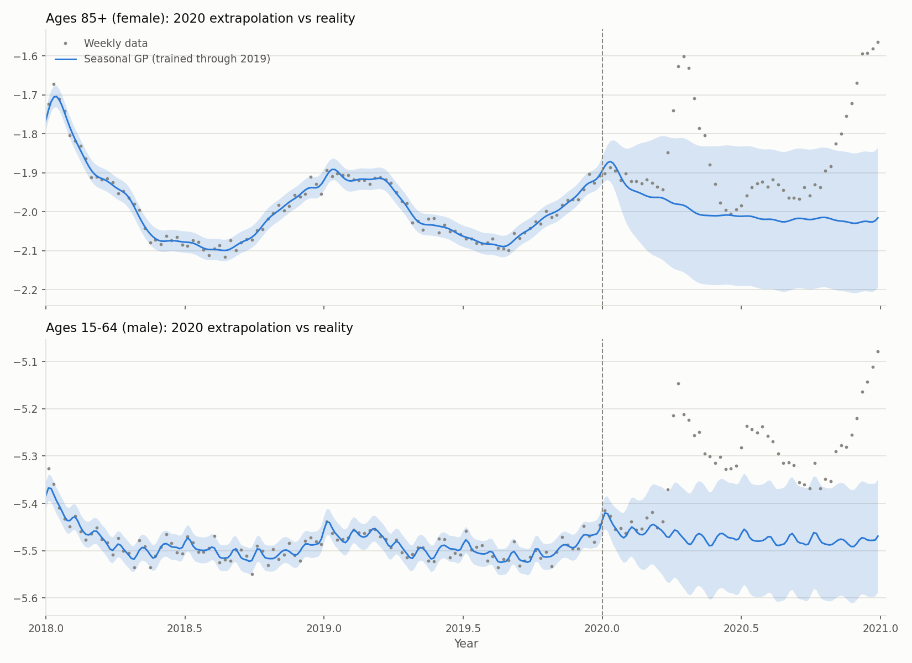
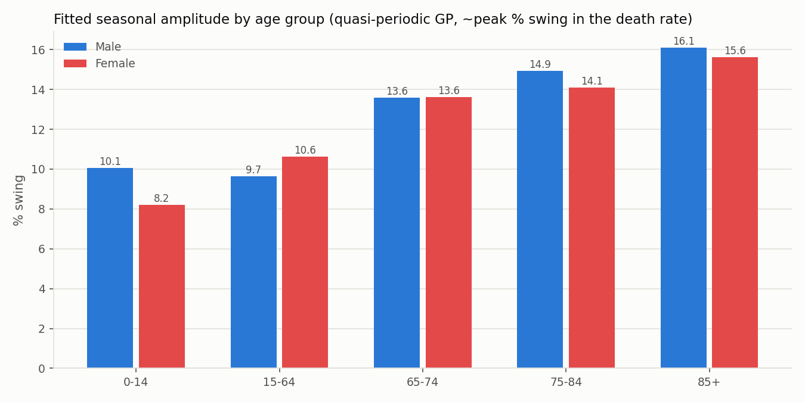
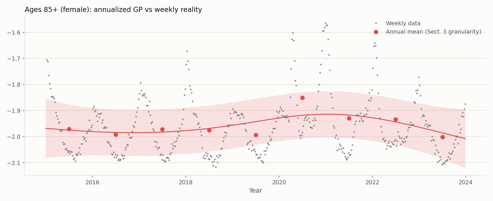

## Overview

This project is a full solution to **Research Project 6: Advanced GP Modeling of Short-Term Mortality Data** from Springer's *An Invitation to Undergraduate Research in Risk Management*, pointing the GPyTorch toolkit at open mortality data. All code, data, and figures live in the [GitHub repo](https://github.com/diffeqsolver/mortality-gp).

The data are weekly all-cause death rates for the USA from the [Short-Term Mortality Fluctuations (STMF) database](https://www.mortality.org/Data/STMF), five age groups × male/female, 2015–2023 (final-vintage data only). The official file arrives in *wide* format — death counts and rates for each age band spread across columns — and is reshaped to long format with age treated **categorically** (one GP per sex × age series): STMF's five coarse, unevenly spaced bands differ by whole units of log-rate, so forcing a shared stationary kernel across a numeric age input would impose smoothness on a dimension observed at five points.

Weekly mortality has two features annual data can't show: a strong winter seasonal cycle, and the COVID-19 shock —

## Research questions

1. How large is intra-year mortality seasonality, and how does it scale with age?
2. What does the COVID shock do to a stationary GP — and what kernel structure repairs it?
3. Do the sexes differ in seasonal amplitude or trend?
4. What does weekly modeling add over the book's Sect. 3-style *annualized* GP models?

## Models

Exact GPs (GPyTorch) on $y = \log$ (annualized weekly death rate), input $x = t$ in decimal years, linear prior mean. The model zoo, per series:

| Model | Kernel |
|---|---|
| `annual` | Matérn-5/2 on annual aggregates (the Sect. 3 baseline) |
| `trend` | Matérn-5/2 |
| `seasonal` | Matérn-5/2 + Periodic (period fixed at 1 yr) |
| `quasi` | Matérn-5/2 (lengthscale ≥ 1 yr) + Periodic × Matérn + Matérn-1/2 (lengthscale ≤ 0.25 yr) |

The `quasi` model's constraints are the interesting part. Fit to 2015–2023 data, an *unconstrained* trend kernel shrinks its lengthscale to ≈ 0.1 yr — the "smooth trend" degenerates into a wiggly interpolator chasing COVID waves. Constraining the trend to stay slow and adding an explicit short-lengthscale **shock channel** restores an interpretable decomposition:

## Results

**COVID breaks a stationary GP exactly as it should.** Trained through 2019 and extrapolated into 2020, the seasonal GP's 95% intervals cover only **19–26%** of 2020 weeks for ages 65–84 (nominal 95%), with average rate errors above 20%:

**Seasonality scales with age; the sexes barely differ in it.** Fitted seasonal amplitude grows monotonically from ≈10% (ages 15–64) to ≈16% (85+) peak swing, nearly identical across sexes — while *levels* differ by a large male excess everywhere, and both sexes share improving post-COVID trends at 65+ of roughly 1.5–2.5%/yr:

**Weekly and annual GPs agree on the long run — and only there.** The annualized baseline fits trend lengthscales of ≈4–6 yr, matching the weekly quasi-GP's — but everything sub-annual (flu winters, COVID wave timing, seasonality itself) is invisible to it, absorbed into its noise term:

**Likelihood alone rewards the wrong model.** BIC prefers the unconstrained `seasonal` model (its trend kernel is free to chase COVID, buying in-sample likelihood), but on a 2023 hold-out the constrained `quasi` model wins decisively: mean RMSE 0.083 vs 0.141 log units, 95%-interval coverage 0.89 vs 0.76, NLPD −0.75 vs −0.06. The interpretability constraints turn out to be the better forecasting prior — a clean miniature of the project brief's "refine and iterate" cycle.

Residual diagnostics (against week-of-year, calendar year, and age group) are flat for adult series at ≈±0.003 log units; the 0–14 series is dominated by small-count observation noise (fitted noise SD ≈0.05 vs ≈0.006 for adults), and the GP correctly declines to find seasonal signal in it.

## Stack

`Python` · `GPyTorch` · `PyTorch` · `Pandas` · `Matplotlib`
