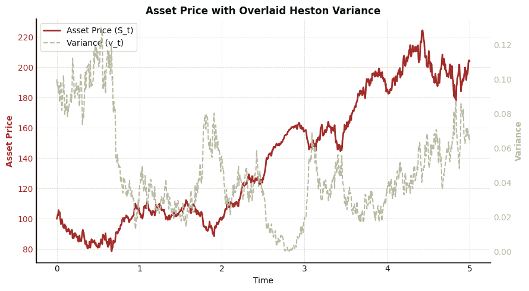
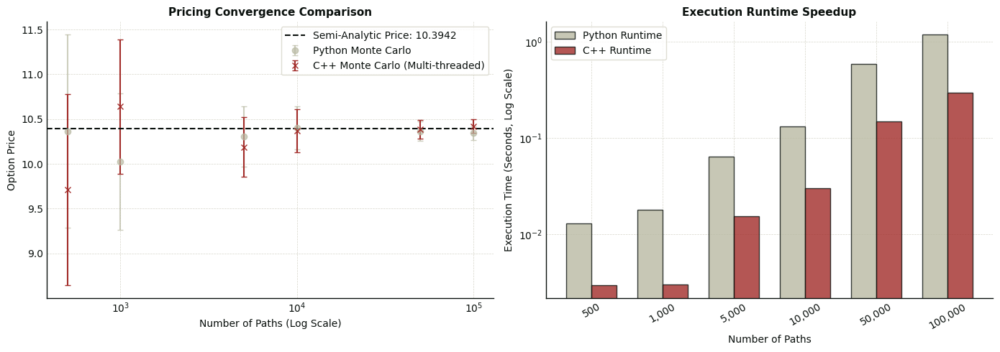

## Overview

This project implements a **hybrid C++/Python option pricing framework** under the Heston stochastic volatility model, comparing a multi-threaded Monte Carlo path simulator against a closed-form semi-analytic Fourier transform pricer. The full build-up — from first-principles probability, to Brownian motion, to SDEs, to the Heston model itself — along with all source code, lives in the [GitHub repo](https://github.com/diffeqsolver/Heston-Hybrid-Option-Pricer).

The asset price and its instantaneous variance evolve as a pair of correlated SDEs:

$$dS_t = \mu S_t\, dt + \sqrt{v_t}\, S_t\, dW_t^{(1)}$$
$$dv_t = \kappa(\theta - v_t)\, dt + \xi \sqrt{v_t}\, dW_t^{(2)}$$

with $dW_t^{(1)} dW_t^{(2)} = \rho\, dt$.

## What I built

- A **semi-analytic Fourier pricer** using the Gatheral/Albrecher stable formulation of the Heston characteristic function, integrated via `scipy.integrate.quad`.
- A **multi-threaded Monte Carlo engine** written in C++ (Log-Euler scheme for the price process, full-truncation for variance) and exposed to Python via `pybind11`.
- Simulated up to **100K paths** to evaluate Monte Carlo convergence against the semi-analytic baseline with 95% confidence intervals.
- A custom Matplotlib plotting suite for dual-axis overlays and side-by-side benchmark visualizations.

## Results

A simulated Heston path, showing the asset price responding to its own stochastic, mean-reverting variance process:

Monte Carlo price estimates converge tightly to the semi-analytic solution as path count grows, and the C++ engine delivers a consistent speedup over the pure-Python Monte Carlo implementation:

The multi-threaded C++ implementation achieves roughly a **3–5x speedup** over pure Python at large path counts, while both converge to the same semi-analytic option price of **10.39**.

## Stack

`Python` · `C++` (pybind11, C++11 threads) · `NumPy` · `SciPy` · `Matplotlib`
